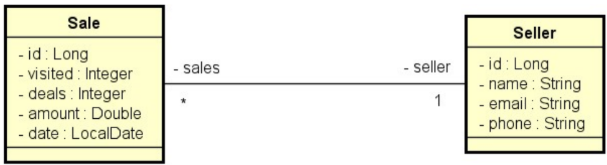

# Desafio 4 DevSuperior - JPA e consultas SQL e JPQL
Quarto desafio do curso Java Spring Professional do Professor Nélio Alves - Dev Superior.

## Descrição do desafio:
Trata-se de um sistema de vendas (Sale) e vendedores (Seller). Cada venda está para um vendedor, e um
vendedor pode ter várias vendas.

Você deverá implementar as seguintes consultas (ambas deverão estar corretas):

### Relatório de vendas
1. [IN] O usuário informa, opcionalmente, data inicial, data final e um trecho do nome do vendedor.
2. [OUT] O sistema informa uma listagem paginada contendo id, data, quantia vendida e nome do vendedor, 
das vendas que se enquadrem nos dados informados.

### Sumário de vendas por vendedor
1. [IN] O usuário informa, opcionalmente, data inicial, data final.
2. [OUT] O sistema informa uma listagem contendo nome do vendedor e soma de vendas deste vendedor no período informado.

## Critérios de avaliação:
- [x] Relatório de vendas sem passar argumentos deve retornar vendas dos últimos 12 meses;
- [x] Relatório de vendas passando argumentos minDate e maxDate deve retornar os dados previstos no enunciado;
- [x] Sumário de vendas por vendedor passando argumentos minDate e maxDate deve retornar os dados previstos no enunciado;
- [x] Sumário de vendas por vendedor sem passar argumentos deve retornar os dados dos últimos 12 meses;

## Competências avaliadas:
- Realização de casos de uso;
- Criação de endpoints de API Rest com parâmetros de consulta opcionais;
- Implementação de consultas em banco de dados relacional com Spring Data JPA.

## Desafios anteriores:
1. https://github.com/paulorc-silva/Desafio-DevSuperior-Componentes-DI
2. https://github.com/paulorc-silva/Desafio-DevSuperior-Dominio-ORM
3. https://github.com/paulorc-silva/Desafio-DevSuperior-CRUD